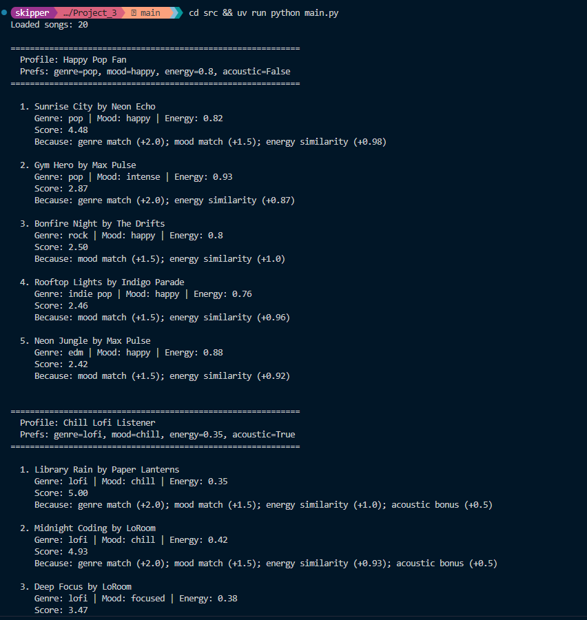
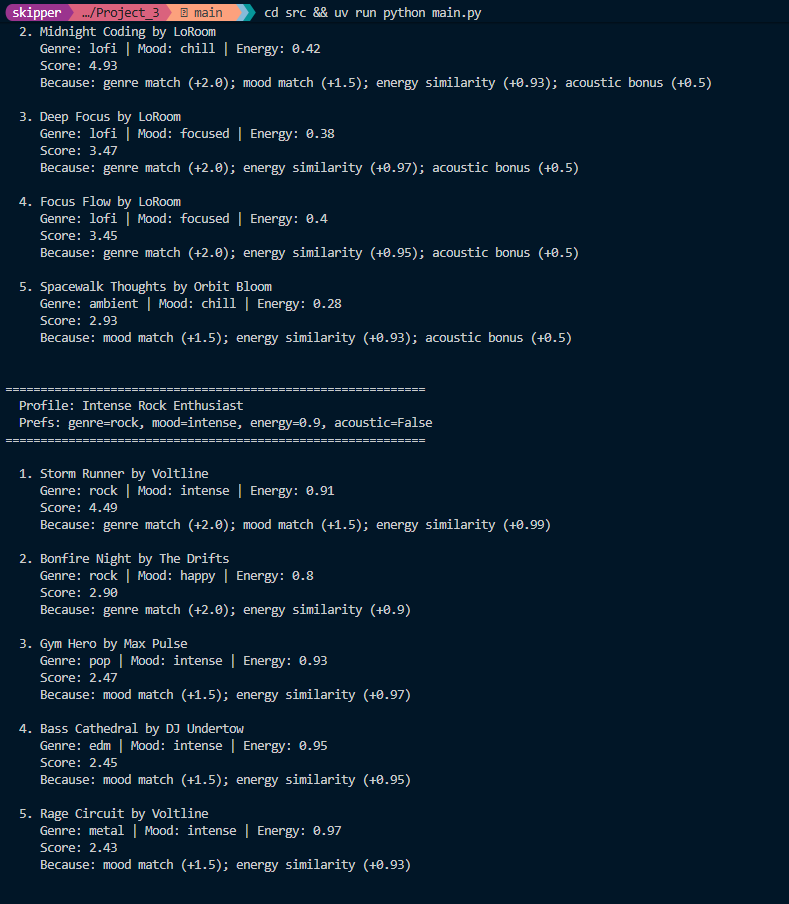
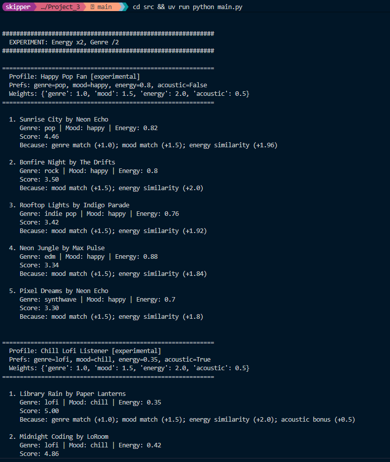
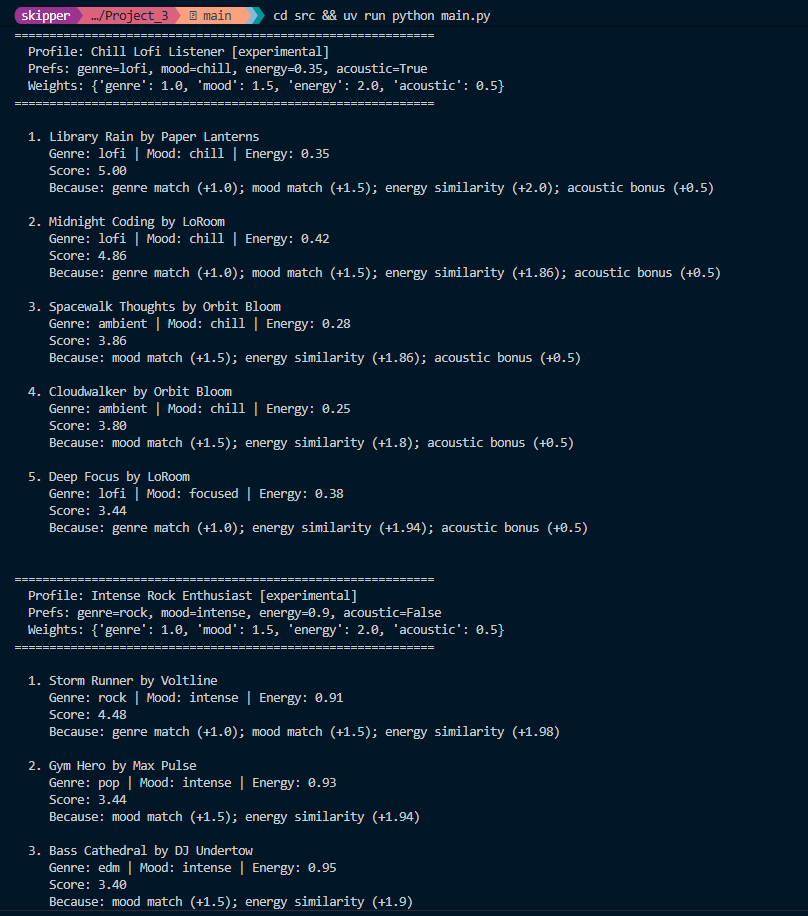
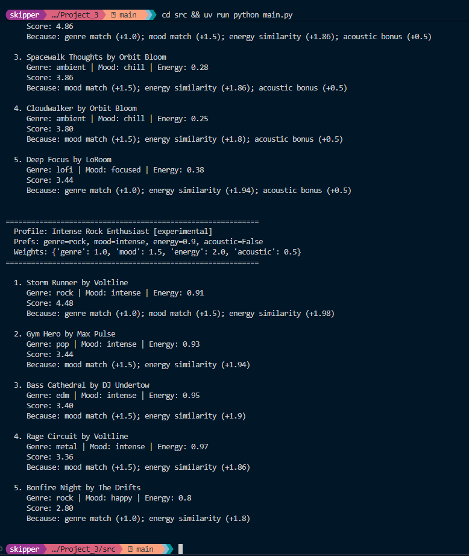

# 🎵 Music Recommender Simulation

## Project Summary

This project is a content-based music recommender that scores songs from a small CSV catalog against a user's taste profile. Each song gets points for matching genre, mood, and having similar energy levels. The system then ranks all songs and returns the top picks with explanations of why each song was recommended.

---

## How The System Works

Real streaming platforms like Spotify use a mix of **collaborative filtering** (looking at what similar users listen to) and **content-based filtering** (matching song attributes to your taste). Collaborative filtering is powerful at scale but needs tons of user data. Our simulation focuses on content-based filtering since we're working with a small catalog and a single user profile.

### Song Features

Each `Song` in our system has these attributes:
- **genre** — categorical label (pop, lofi, rock, edm, etc.)
- **mood** — categorical label (happy, chill, intense, sad, relaxed, focused, moody)
- **energy** — numerical score from 0.0 to 1.0
- **tempo_bpm** — beats per minute
- **valence** — musical positivity from 0.0 to 1.0
- **danceability** — how danceable, from 0.0 to 1.0
- **acousticness** — how acoustic, from 0.0 to 1.0

### User Profile

A `UserProfile` stores:
- `favorite_genre` — the genre the user prefers
- `favorite_mood` — the mood the user gravitates toward
- `target_energy` — their ideal energy level (0.0–1.0)
- `likes_acoustic` — whether they prefer acoustic-heavy tracks

### Algorithm Recipe

The scoring logic awards points per song:
- **+2.0 points** for a genre match
- **+1.5 points** for a mood match
- **Up to +1.0 point** for energy similarity (closer = more points, calculated as `1.0 - abs(song_energy - target_energy)`)
- **+0.5 points** for acousticness bonus (if the user likes acoustic and the song's acousticness > 0.7)

Songs are scored individually, sorted highest-to-lowest, and the top K are returned.

### Data Flow

```
Input (User Preferences) → Score each song in CSV → Sort by score → Output top K recommendations
```

### Potential Biases

This system might over-prioritize genre since it carries the heaviest weight (+2.0). A great song that matches mood and energy perfectly but is in the wrong genre will score lower than a mediocre genre match. The small dataset also means some genres are overrepresented (e.g., multiple lofi tracks).

---

## Getting Started

### Setup

1. Install dependencies with UV:

```bash
uv sync
```

2. Run the app:

```bash
uv run python -m src.main
```

### Running Tests

```bash
uv run pytest
```

---

## Terminal Output

### Default weights




### Experimental weights (energy x2, genre /2)





---

## Experiments You Tried

### Profile comparisons

I tested three profiles and compared their outputs.

Pop Fan vs Rock Enthusiast: both top results scored about the same (4.48 and 4.49) since they each matched genre + mood + similar energy. What was more interesting was Bonfire Night (rock/happy) showing up in both top 5s. It ranked #3 for Pop because of mood match and #2 for Rock because of genre match. Same song, totally different reasons for being there.

Lofi Listener vs Pop Fan: zero overlap between the two lists. The Lofi profile pulled all low energy acoustic tracks while Pop got upbeat high energy stuff. The acoustic bonus (+0.5) ended up being what separated Library Rain from Midnight Coding within the lofi cluster, which I wouldn't have predicted.

Rock vs Lofi: basically opposite ends of the energy spectrum (0.9 vs 0.35). Rock's #5 was Rage Circuit at 0.97 energy, Lofi's #5 was Spacewalk Thoughts at 0.28. Energy similarity did a lot of the heavy lifting once genre and mood were already factored in.

### Weight shift experiment

I doubled energy weight (1.0 to 2.0) and halved genre (2.0 to 1.0).

For Pop, Bonfire Night (rock/happy) jumped from #3 to #2 because it has perfect energy match (0.8 = target), and that mattered more now than Gym Hero's genre match. For Rock, Gym Hero (pop/intense) moved from #3 to #2 since high energy was worth more than being the right genre. The Lofi profile barely changed because Library Rain already had a perfect score, though Spacewalk Thoughts (ambient/chill) crept up past some lofi/focused tracks.

Takeaway: genre weight basically decides the top half of every list under default settings. Cutting it made the results feel more like "songs that match your vibe" rather than "songs in your genre."

---

## Limitations and Risks

- Only 20 songs. Real platforms have millions. Not enough variety for niche tastes.
- Genre weight is too high by default. A perfect mood + energy match in the wrong genre loses to a mediocre song that happens to be the right genre.
- No hip-hop, classical, R&B, or country in the catalog at all. Those users just get bad results.
- Can't handle mixed preferences. If you like both chill lofi and intense rock depending on your mood, tough luck, pick one.
- No feedback loop. The system never finds out if you actually liked what it suggested.

More on this in [model_card.md](model_card.md).

---

## Reflection

[Model Card](model_card.md)

The gap between "the scoring logic works" and "the recommendations are actually good" is bigger than I expected going in. The math part is simple enough: match some attributes, add points, sort. But whether the results feel right depends almost entirely on weight tuning and what data you have. A system can be technically correct and still give bad suggestions if the weights are off or the catalog is lopsided.

The bias angle was what stuck with me most. My system just naturally favors genres that have more entries in the dataset because there are more candidates to score well. A lofi fan has four good options. A metal fan has one. In a real product that kind of gap means some users have a great time and others feel like the app doesn't get them, and the system has no way of knowing because it never asks.

